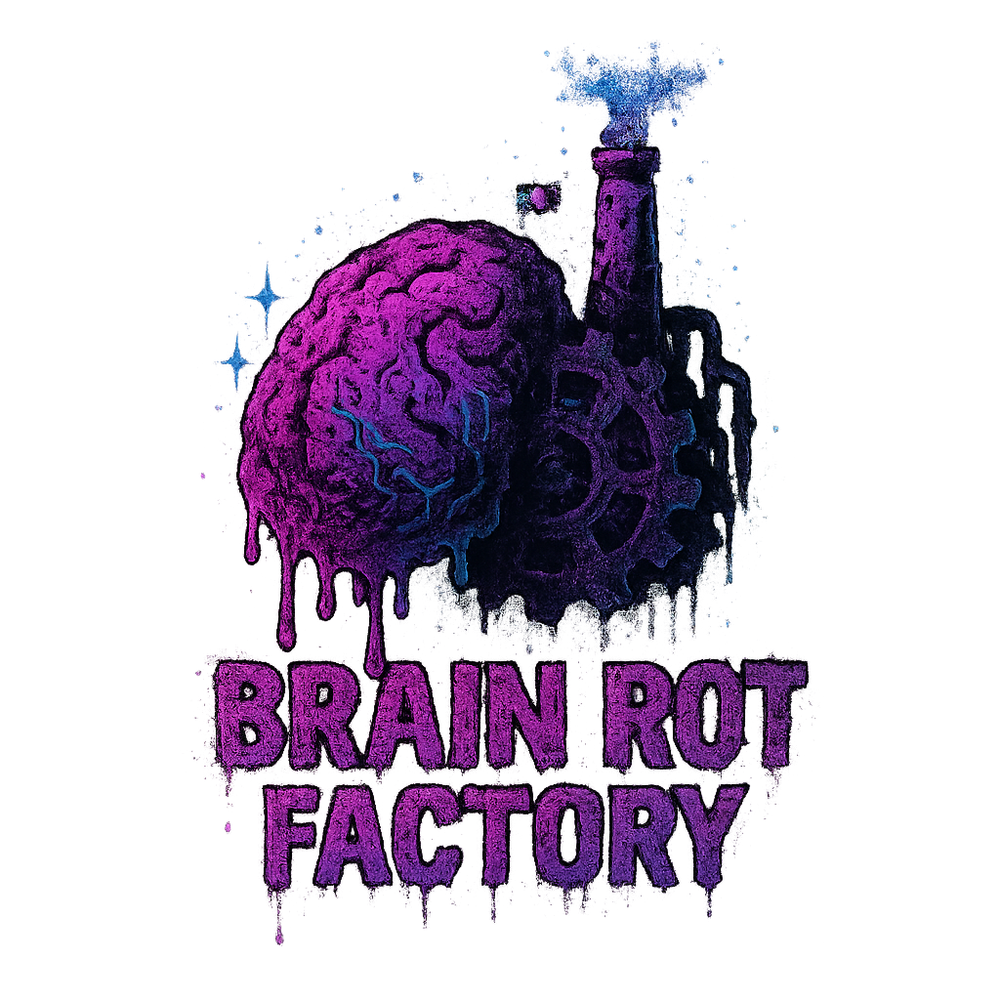

<div align="center">
  
  
  # Vibecode Playground
  
  [](https://github.com/rodrigogs/vibecode-playground/actions)
  [](https://codecov.io/gh/rodrigogs/vibecode-playground)
</div>

Modern TypeScript monorepo with Turbo for high-performance builds. Chat with AI-powered Italian brain-rot meme characters! 🧠💬

## Structure

```
├── apps/
│   ├── brain-rot-factory/        # Next.js web app with AI chat interface
│   └── example/                  # CLI app with AI capabilities
├── packages/
│   ├── ai/                       # AI agents with LangChain
│   ├── cache/                    # Caching system (memory/filesystem)
│   ├── logger/                   # Structured logging
│   ├── utils/                    # File and time utilities
│   ├── template/                 # Package template
│   ├── eslint-config/            # Shared ESLint configs
│   ├── typescript-config/        # Shared TypeScript configs
│   └── test/                     # Shared Vitest config
```

## Stack

- **Turbo** - Monorepo orchestration
- **TypeScript** - Dual ESM/CJS builds
- **Vitest** - Testing with coverage
- **ESLint** - Linting with shared configs
- **LangChain** - AI capabilities

## Quick Start

```bash
git clone https://github.com/rodrigogs/vibecode-playground.git
cd vibecode-playground
npm install
npm run build
```

## Commands

```bash
npm run build         # Build all packages
npm run dev          # Development mode
npm test             # Run tests
npm run lint         # Lint code
```

## Environment

```bash
OPENAI_API_KEY=      # For AI functionality
DEEPSEEK_API_URL=    # DeepSeek API
DEEPSEEK_API_KEY=    # DeepSeek key
```

## Packages

| Package                   | Description                          |
| ------------------------- | ------------------------------------ |
| `@repo/ai`                | AI agents with LangChain integration |
| `@repo/cache`             | Memory and filesystem caching        |
| `@repo/logger`            | Structured logging with debug        |
| `@repo/utils`             | File and time utilities              |
| `@repo/template`          | Package creation template            |
| `@repo/eslint-config`     | Shared ESLint configurations         |
| `@repo/typescript-config` | Shared TypeScript configurations     |
| `@repo/test`              | Shared Vitest testing utilities      |
